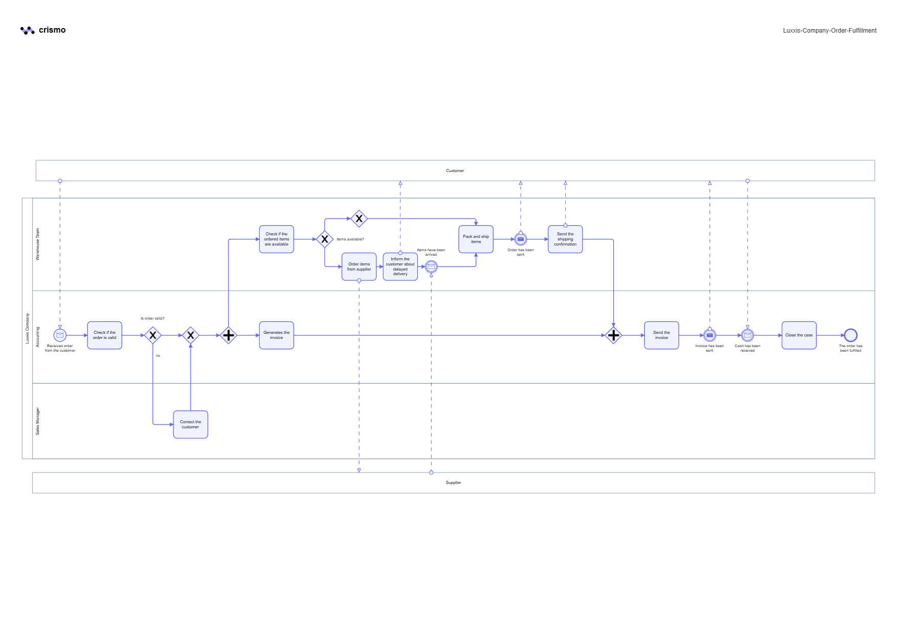
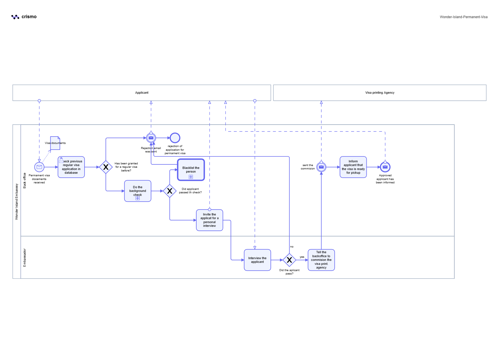
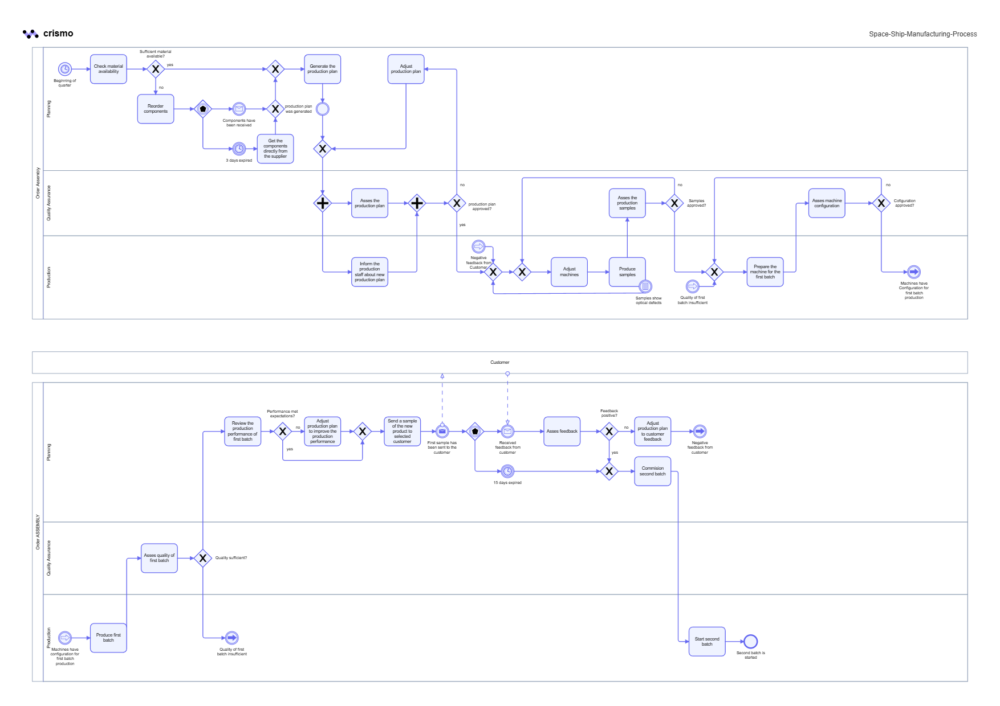
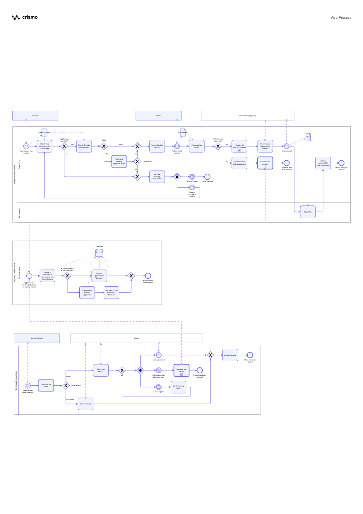

# 📚 Course-Based BPMN Projects

This section contains selected business process diagrams that I created as part of my practical learning of **BPMN 2.0**.

The models presented here were created while completing exercises from **The Ultimate BPMN Course by Packt**. The business scenarios are based on the course materials, while the diagrams represent my own process modeling work.

The selected projects demonstrate my progress in understanding and applying BPMN 2.0 in practice, as well as my experience working with processes of varying levels of complexity.

## 📦 01. Luxxis Company – Order Fulfillment Process

A business process illustrating the end-to-end handling of a customer order, involving the **Sales Manager, Accounting, and Warehouse Team**, as well as communication with the **Customer and Supplier**.

The process covers:
- order validation,
- product availability verification,
- handling unavailable products and communication with the supplier,
- invoice generation and delivery,
- order preparation and shipping,
- customer communication,
- closing the process after payment is received.

### 🔎 BPMN Diagram

📄 [View the full diagram in PDF format](./Luxxis-Company-Order-Fulfillment.pdf)

## 🏝️ 02. Wonder Island – Permanent Visa Process

A process illustrating the handling of a permanent visa application by the **Wonder Island Embassy**.

The model covers:
- checking the applicant's previous visa application history,
- conducting a background check,
- arranging and conducting a personal interview,
- handling positive and negative application decisions,
- blacklisting the applicant in case of rejection,
- coordinating with an external visa printing agency,
- informing the applicant when the visa is ready for collection.

### 🔎 BPMN Diagram

📄 [View the full diagram in PDF format](./Wonder-Island-Permanent-Visa.pdf)

## 🚀 03. Space Ship Manufacturing Process

A complex manufacturing process involving collaboration between **Planning, Production, and Quality Assurance**.

The model covers:
- checking material availability,
- handling missing components,
- preparing and approving the production plan,
- producing and assessing product samples,
- configuring production machines,
- producing and performing quality control of the first batch,
- evaluating production performance,
- collecting and assessing customer feedback,
- adjusting the production plan based on performance results and customer feedback,
- starting the second production batch.

### 🔎 BPMN Diagram

📄 [View the full diagram in PDF format](./Space-Ship-Manufacturing-Process.pdf)

## 🛂 04. Visa Process

The most complex BPMN case in this section, covering several interconnected processes related to visa application handling and visa compliance.

The model covers:
- verifying document completeness,
- handling missing documents,
- differentiating the process for adult and underage applicants,
- verifying parental approval,
- communicating with the police and assessing the applicant's police record,
- approving or rejecting a visa application,
- commissioning an external agency to print the visa,
- updating applicant information in the database,
- blocking and blacklisting applicants,
- handling visa overstay cases.

### 🔎 BPMN Diagram

📄 [View the full diagram in PDF format](./Visa-Process.pdf)

## 📈 Project Purpose

The purpose of these projects is to develop practical skills in **business process modeling and analysis using BPMN 2.0**.

As I continue learning and developing my Business Analysis skills, I plan to expand my main portfolio with **independently developed business scenarios and original case studies**, which will be presented in a separate `Independent-Projects` section.
